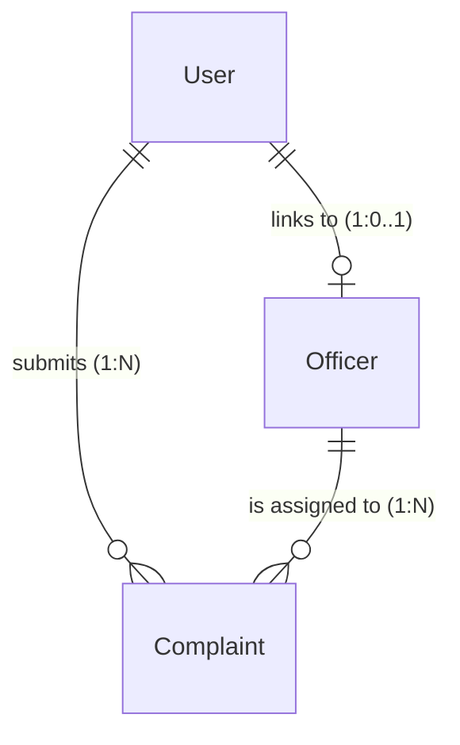

# Database Module Documentation

This document describes the MongoDB database design, collections, schemas, enums, defaults, and relationships for the **Smart Public Grievance Management System (SPGMS)** database layer.

---

## 1. Database Collections Overview

The database consists of three primary collections:
1. **`users`**: Stores authentication and user profile details (Citizens, Officers, Admins).
2. **`officers`**: Extends the `users` collection for members of the government department resolver teams.
3. **`complaints`**: Stores details of grievances uploaded by citizens, automated AI classification metadata, location coordinates, assignments, and resolution statuses.

---

## 2. Collection Schemas & Field Specifications

### 2.1. Users Collection (`users`)

| Field Name | Mongoose Type | Required | Unique | Validation / Allowed Values | Default Value | Notes |
| :--- | :--- | :---: | :---: | :--- | :---: | :--- |
| `fullName` | `String` | Yes | No | Trimmed | - | Full name of the user |
| `email` | `String` | Yes | Yes | Trimmed, Lowercase, Regex Email format | - | Unique login identifier |
| `password` | `String` | Yes | No | Plaintext/Hashed | - | Login password |
| `phoneNumber`| `String` | Yes | No | Trimmed | - | Contact number |
| `role` | `String` | Yes | No | Enum: `['Citizen', 'Officer', 'Admin']` | - | Access control level |
| `createdAt` | `Date` | Auto | No | - | Auto | Mongoose timestamp |
| `updatedAt` | `Date` | Auto | No | - | Auto | Mongoose timestamp |

---

### 2.2. Officers Collection (`officers`)

| Field Name | Mongoose Type | Required | Unique | Validation / Allowed Values | Default Value | Notes |
| :--- | :--- | :---: | :---: | :--- | :---: | :--- |
| `user` | `ObjectId` | Yes | Yes | Reference to `User` model | - | Relational key linking to `users` collection |
| `department` | `String` | Yes | No | Enum: `['Road Department', 'Electrical Department', 'Water Department']` | - | Department assignment |
| `assignedArea`| `String` | Yes | No | Trimmed | - | Sector or Ward name |
| `designation` | `String` | Yes | No | Trimmed | - | Job title / Role |
| `availability`| `Boolean` | No | No | `true` or `false` | `true` | Current dispatch status |
| `createdAt` | `Date` | Auto | No | - | Auto | Mongoose timestamp |
| `updatedAt` | `Date` | Auto | No | - | Auto | Mongoose timestamp |

---

### 2.3. Complaints Collection (`complaints`)

| Field Name | Mongoose Type | Required | Unique | Validation / Allowed Values | Default Value | Notes |
| :--- | :--- | :---: | :---: | :--- | :---: | :--- |
| `citizen` | `ObjectId` | Yes | No | Reference to `User` model | - | Citizen who filed the complaint |
| `complaintImageUrl` | `String` | Yes | No | Url format | - | Path to image (e.g. S3 / Cloudinary) |
| `manualDescription` | `String` | Yes | No | Trimmed | - | Citizen description of the problem |
| `aiGeneratedDescription` | `String` | No | No | Trimmed | `""` | Description inferred from YOLO/Gemini API |
| `complaintCategory` | `String` | Yes | No | Enum: `['Pothole', 'Electricity Problem', 'Water Leakage']` | - | Restricted category list |
| `department` | `String` | Yes | No | Enum: `['Road Department', 'Electrical Department', 'Water Department']` | *(Auto)* | Set automatically via Schema pre-validate hook |
| `priority` | `String` | Yes | No | Enum: `['High', 'Medium', 'Low']` | `Medium` | Urgency rating |
| `status` | `String` | Yes | No | Enum: `['Pending', 'Seen', 'In Progress', 'Resolved']` | `Pending` | Resolution workflow tracker |
| `latitude` | `Number` | Yes | No | Coordinates | - | Latitude coordinate |
| `longitude` | `Number` | Yes | No | Coordinates | - | Longitude coordinate |
| `address` | `String` | Yes | No | Trimmed | - | Text address matching coordinates |
| `assignedOfficer` | `ObjectId` | No | No | Reference to `Officer` model | `null` | Officer assigned to resolve this issue |
| `resolutionImage` | `String` | No | No | Url format | `null` | Photo upload showing completed resolution |
| `officerRemarks` | `String` | No | No | Trimmed | `""` | Resolution updates/notes by Officer |
| `createdAt` | `Date` | Auto | No | - | Auto | Mongoose timestamp (Created Time) |
| `updatedAt` | `Date` | Auto | No | - | Auto | Mongoose timestamp (Updated Time) |

---

## 3. Schema Hooks & Automations

### 3.1. Category-to-Department Mapping Hook
A Mongoose pre-validate hook on the **Complaint** schema automatically sets the `department` string value matching the selected `complaintCategory`. The mappings are:

* **`Pothole`** $\rightarrow$ **`Road Department`**
* **`Electricity Problem`** $\rightarrow$ **`Electrical Department`**
* **`Water Leakage`** $\rightarrow$ **`Water Department`**

---

## 4. Collection Relationships

The schemas utilize `Schema.Types.ObjectId` to define relationships:

1. **`User` $\rightarrow$ `Officer`** (One-to-One):
   * `Officer.user` is a unique index pointer to `User._id`. Only users with `role: 'Officer'` should have a corresponding `Officer` document.
2. **`User` $\rightarrow$ `Complaint`** (One-to-Many):
   * `Complaint.citizen` references `User._id` to fetch profile details (name, email, phone) of the reporting citizen.
3. **`Officer` $\rightarrow$ `Complaint`** (One-to-Many):
   * `Complaint.assignedOfficer` references `Officer._id` to fetch the officer details (designation, department, area) assigned to resolving the grievance.
